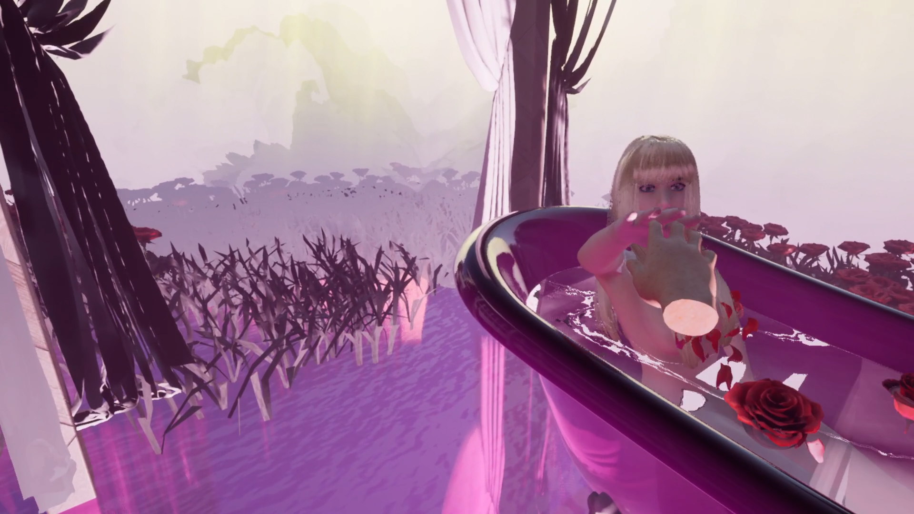

## information    

- Project Installation Title: Ordinary dreams and lucid dreams through interaction in VR
- Category: Master Thesis  
- Student/s: Xuejie Wei
- Master Thesis Title: Lucid Dreaming in VR
- Course Title: Rauchwolken und Luftschlösser    
- Lecturer/s: Andrea Sick, Rene Weller   
- Year: SS 2023/24

## text + images + videos    

    

Abstract

This project explores the potential of virtual reality (VR) technology to help people understand and distinguish lucid dreams from ordinary dreams. While lucid dreaming is an effective treatment for nightmares, achieving it can be challenging and requires extensive training. Through an interactive VR experience, this study aims to provide participants with an immersive and realistic environment to experience lucid and ordinary dreams. Interviews with experienced lucid dreamers, dream creation in VR and hand tracking with Meta quest2 were used to measure the effectiveness of VR in improving participants' understanding of lucid dreams and participants' understanding of the differences between lucid and ordinary dreams. This study aimed to investigate whether VR can help people immerse themselves in lucid dreams and develop an interest in lucid dreaming and potentially increase its use as a lucid dream therapy.
  
   

   

  

     

     